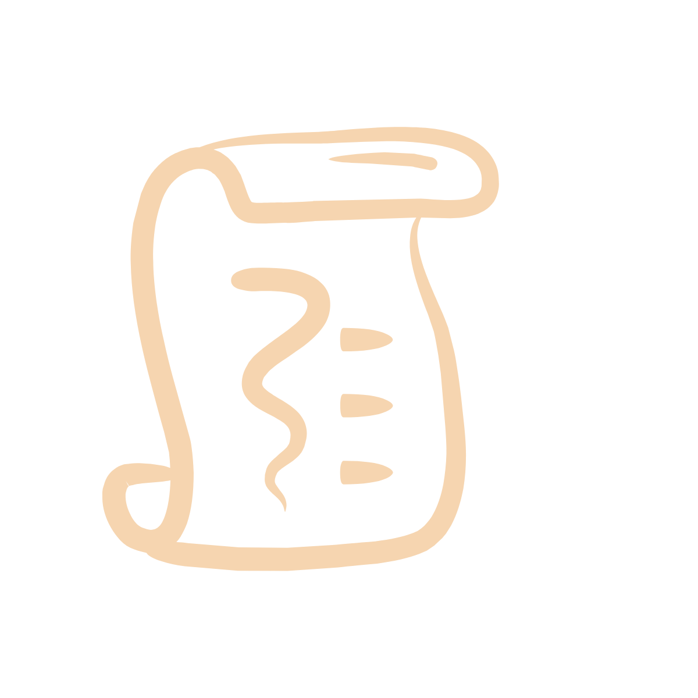
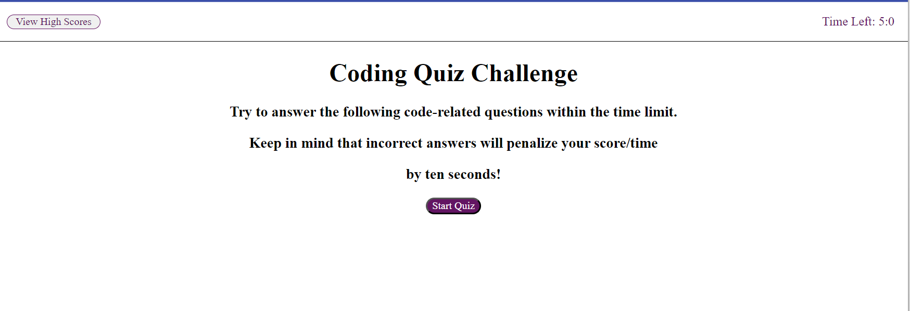
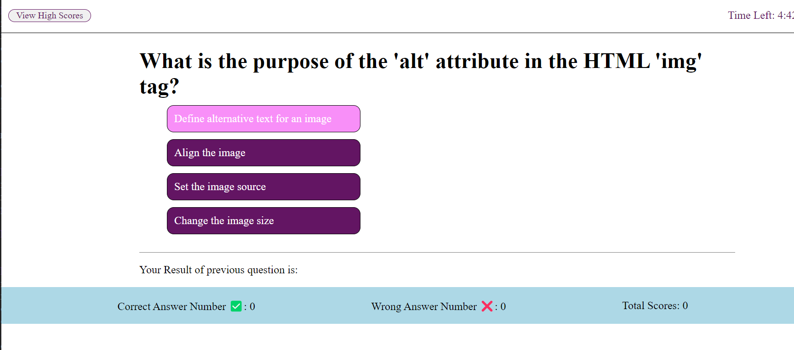
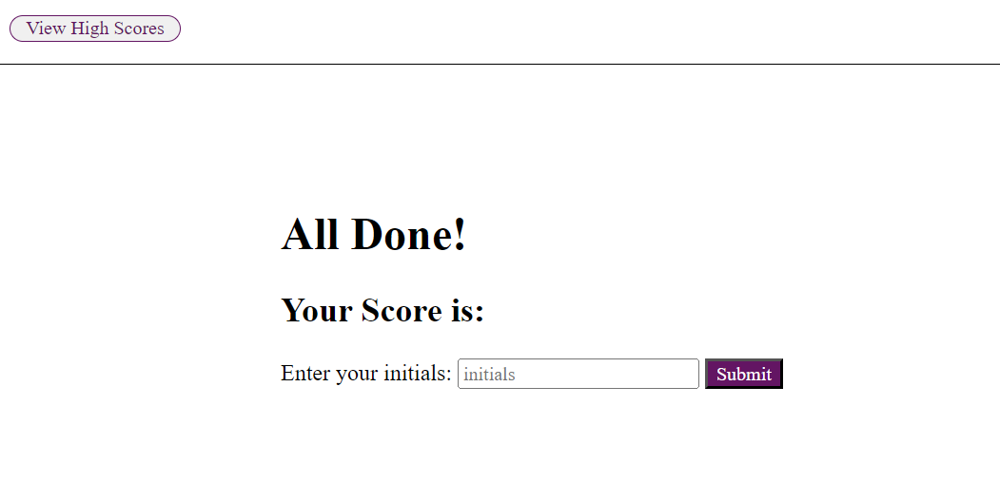
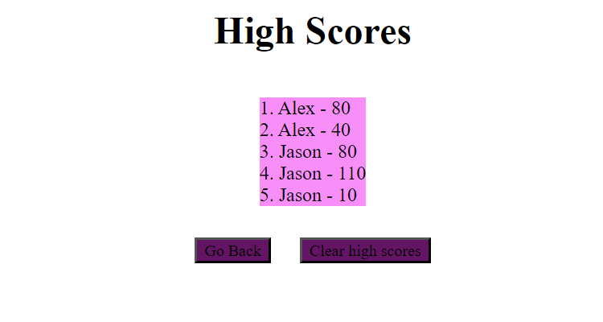

<a id="readme-top"></a>

<!-- project title information -->
<div align="center">
  <a href="https://github.com/Jason897571/Fun-Quiz">
    
  </a>

  <h3 align="center">Fun Quiz</h3>

  <p align="center">
    This a fun quiz about CSS, HTML and JS. <br />You will test your development skills through this quiz. Good luck!
    <br />
    <a href="https://github.com/Jason897571/Fun-Quiz"><strong>Click here for Github Repo  »</strong></a>
    <br />
    <br />
    <a href="https://jason897571.github.io/Fun-Quiz/">View Demo</a>
    ·
    <a href="https://github.com/Jason897571/Fun-Quiz/issues">Report Bug</a>
    ·
    <a href="https://github.com/Jason897571/Fun-Quiz/issues">Request Feature</a>
  </p>
</div>

<!-- TABLE OF CONTENTS -->
<details>
  <summary>Navigation of Contents</summary>
  <ol>
    <li>
      <a href="#about-the-project">About The Project</a>
      <ul>
        <li><a href="#built-with">Built With</a></li>
      </ul>
    </li>
    <li>
      <a href="#getting-started">Getting Started</a>
      <ul>
        <li><a href="#prerequisites">Prerequisites</a></li>
        <li><a href="#installation">Installation</a></li>
      </ul>
    </li>
    <li><a href="#usage">Usage</a></li>
    <li><a href="#contact">Contact</a></li>
    <li><a href="#future_additions">Future Additions</a></li>
  </ol>
</details>

<a id="#about-the-project"></a>
## About The Project

<p><strong>Start Page</strong></p>



<br />

This is a fun quiz game that will test your knowledge of HTML, CSS and Javascript. You have limited time to complete all questions. When you get the wrong answer, you will lose 10 seconds of time. If you get the right answer, you will get 10 scores.

When the time is over, you will go to the result page and see your score. After you input your initial, you can see all the result in rank board.

<a id="#built-with"></a>
## Built with
This Quiz is built with HTML, CSS and Javascript.
* [][HTML-url]
* [][CSS-url]
* [][Javascript-url]

<p align="right">(<a href="#readme-top">back to top</a>)</p>

<a id="getting_started"></a>
## Getting Started

This is an example of how you may give instructions on setting up your project locally.
To get a local copy up and running follow these simple example steps.

<a id="prerequisities"></a>
### Prerequisites

You should have your shell ready for downloading this project. We use gitbash as an example in this project

<a id="installation"></a>
### Installation
1. Get a free API Key at [github](https://github.com/Jason897571/Fun-Quiz#built-with)
2. Clone the repo
   ```sh
   git clone git@github.com:Jason897571/Fun-Quiz.git
   ```
3. Open the project using vs code and run it in browser


<p align="right">(<a href="#readme-top">back to top</a>)</p>


<a id="usage"></a>
## Usage

when you your mouse hovering on the option, the option for each question will turn to light purple. When you choose the option, it will move to the next question. You can see the result for the previous quesiton.

<p><strong>Quiz Page</strong></p>



When the time is up or your complete the quiz, it will bring you to the initial page where you can input your inital and store your scores.

<p><strong>Result Page</strong></p>



After you submit your initial and score, you will see the final rank board. By clicking the "Go Back" button , you can go back to the start page. By clicking the "Clear high scores" button, you can clear all scores and initials.


<p><strong>Rank Page </strong></p> 


For more details, please refer to the [Documentation](https://github.com/Jason897571/Fun-Quiz)

<p align="right">(<a href="#readme-top">back to top</a>)</p>


<a id="future_additions"></a>
## Future Additions
* Different question types can be added
* A difficulty Options panel can be added to start page
* A Panel to show historical correct and incorrect questions can be added
* The ranking system can be added to have the highest score in the first place in the rank page.

<p align="right">(<a href="#readme-top">back to top</a>)</p>


<a id="contact"></a>
## Contact

Jason Gu - [Email](king.gs1314@outlook.com) - king.gs1314@outlook.com

Project Link: [https://github.com/Jason897571/Fun-Quiz](https://github.com/Jason897571/Fun-Quiz)

<p align="right">(<a href="#readme-top">back to top</a>)</p>

<!-- MARKDOWN LINKS & IMAGES -->
<!-- https://www.markdownguide.org/basic-syntax/#reference-style-links -->
[css-url]:https://img.shields.io/badge/CSS-239120?&style=for-the-badge&logo=css3&logoColor=white
[HTML-url]:https://img.shields.io/badge/HTML-239120?style=for-the-badge&logo=html5&logoColor=white
[Javascript-url]:https://img.shields.io/badge/JavaScript-F7DF1E?style=for-the-badge&logo=javascript&logoColor=black